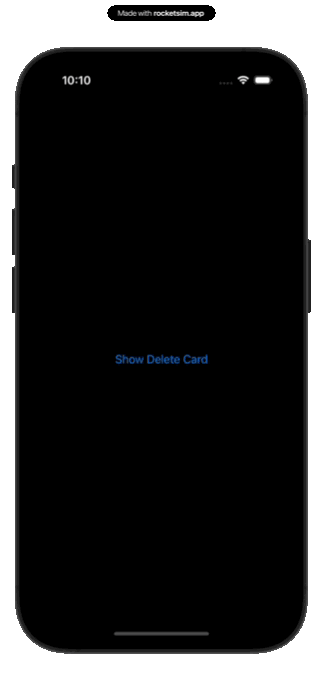

## HoldToDelete SwiftUI Component

This project demonstrates a SwiftUI component for confirming and handling the deletion of an account. It includes a main content view with a button to trigger the delete card, a custom delete card view with a long-press button for deletion confirmation, and visual feedback components.

### Features

* Animated Delete Card: Slide-up animation for the delete card.
* Hold to Delete: Long-press gesture to confirm the deletion.
* Visual Feedback: Progress indicator for the long-press action.
* Cancel Button: Option to cancel the delete action.

### Screenshot

